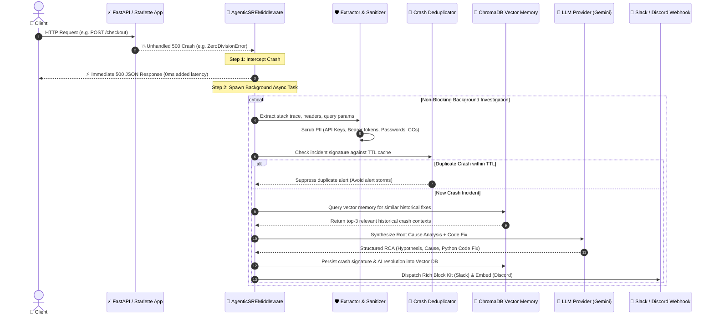

# 🤖 Agentic-SRE

<div align="center">

> **Autonomous, LLM-Agnostic Observability & AI Bug Detective Middleware for Python Backends**

[](https://github.com/priyansh-69/sre-watchdog/actions/workflows/ci.yml)
[](https://www.python.org/downloads/)
[](https://fastapi.tiangolo.com/)
[](https://github.com/psf/black)
[](https://mypy.readthedocs.io/)
[](https://github.com/PyCQA/bandit)
[](LICENSE)

[**Quickstart**](#-quickstart-in-60-seconds) •
[**Architecture**](#-architecture--how-it-works) •
[**Key Superpowers**](#-key-superpowers) •
[**Configuration**](#-configuration) •
[**Advanced Customization**](#-advanced-customization) •
[**Contributing**](#-contributing--local-development)

</div>

---

## 💡 What is Agentic-SRE?

**Agentic-SRE** is a lightweight, zero-latency ASGI middleware that intercepts unhandled `500 Internal Server Error` crashes in **FastAPI** and **Starlette** applications.

Instead of waking up on-call engineers at 3 AM to decipher raw stack traces, `agentic-sre` acts as an autonomous tier-1 SRE:
1. **Instantly returns** a standard `500 Internal Server Error` to the client (adding **0ms latency**).
2. **Extracts & scrubs** sensitive PII, API tokens, passwords, and authorization headers in memory.
3. **Cross-references** previous incidents using local serverless RAG vector memory (**ChromaDB**).
4. **Conducts AI Root Cause Analysis (RCA)** via Google Gemini (or any pluggable LLM).
5. **Delivers rich, actionable fix reports** with executable code solutions directly to **Slack** and **Discord**.

---

## ⚡ Architecture & How It Works

Agentic-SRE operates on an **"Intercept, Release, and Investigate"** asynchronous lifecycle:



---

## 🚀 Key Superpowers

* **⚡ Zero-Latency Guarantee**: Uses ASGI non-blocking handoff (`asyncio.create_task`) to return instant 500 responses without blocking the client thread or event loop.
* **🛡️ Military-Grade PII Sanitization**: Recursively scrubs passwords, Bearer tokens, AWS/Stripe/OpenAI API keys, email addresses, credit cards, and prompt injection vectors before anything touches an LLM.
* **🧠 Self-Learning RAG Memory**: Powered by local, embedded **ChromaDB**. When a new crash happens, it searches previous resolutions and feeds that context into the LLM.
* **🔕 Smart Deduplication & Alert Throttling**: Configurable TTL-based deduplication hash ring prevents alert storms, Slack spam, and API cost explosions during cascading outages.
* **🚦 Built-in Backpressure & OOM Guard**: Sets strict concurrency bounds on background analysis tasks to prevent server memory exhaustion under heavy traffic spikes.
* **🔌 LLM-Agnostic Strategy Pattern**: First-class support for **Google Gemini (`google-genai`)**, with clean abstractions (`BaseAIProvider`) ready for Groq, OpenAI, Ollama, and Anthropic.
* **🛑 Graceful Shutdown Integration**: Includes ASGI `sre_lifespan` context manager to flush all in-flight AI investigation tasks safely during server restarts or deployments.
* **🔇 100% Fail-Silent Guarantee**: The middleware will **never** crash your host application if an AI API or webhook fails.

---

## 📦 Quickstart in 60 Seconds

### 1. Installation

```bash
pip install agentic-sre
```

### 2. Configure Environment

Create a `.env` file in your project root:

```env
# AI Provider (Google Gemini)
AGENTIC_AI_PROVIDER="gemini"
GEMINI_API_KEY="your_google_ai_studio_api_key"

# Notification Webhooks (Provide one or both)
SLACK_WEBHOOK_URL="https://hooks.slack.com/services/T00/B00/XXXXXX"
DISCORD_WEBHOOK_URL="https://discord.com/api/webhooks/123456/XXXXXX"
```

### 3. Add to FastAPI / Starlette

```python
import uvicorn
from fastapi import FastAPI
from agentic_sre import AgenticSREMiddleware, sre_lifespan

# 1. Attach lifespan for graceful shutdown flushing
app = FastAPI(title="My Production API", lifespan=sre_lifespan)

# 2. Attach Agentic-SRE Middleware
app.add_middleware(AgenticSREMiddleware)

@app.get("/")
async def root():
    return {"status": "healthy"}

@app.get("/checkout")
async def checkout():
    # Simulate a sudden production crash
    cart_items = []
    avg_price = sum(cart_items) / len(cart_items)  # ZeroDivisionError
    return {"avg_price": avg_price}

if __name__ == "__main__":
    uvicorn.run("main:app", host="0.0.0.0", port=8000, reload=True)
```

Trigger `http://localhost:8000/checkout` — your client gets an immediate `500 Internal Server Error`, while your Slack/Discord channel receives a full AI diagnostic report with a suggested fix in seconds!

---

## 🔔 Rich Notification Preview

### Slack (Block Kit) & Discord (Rich Embed)

```text
🔴 [CRITICAL CRASH] FastAPI 500 Internal Server Error
─────────────────────────────────────────────────────────────
📍 Endpoint:        GET /checkout
🔗 Correlation ID:  b4c129e1-678a-4efb-86d1-cf19a3bb09a2
💥 Exception:       ZeroDivisionError: division by zero
📁 Location:        app/routes/checkout.py:42 in calculate_totals()
─────────────────────────────────────────────────────────────
🧠 AI Root Cause Analysis
Attempted division by zero when calculating average price for an empty shopping cart.
The function expects len(cart_items) > 0, but no empty cart guard was present before division.

💡 Suggested Fix
```python
if not cart_items:
    return {"avg_price": 0.0}
avg_price = sum(cart_items) / len(cart_items)
```
─────────────────────────────────────────────────────────────
⏱️ Agentic-SRE v0.1.0 • Autonomous SRE Detective
```

---

## ⚙️ Configuration Reference

All settings can be configured via environment variables or `.env`:

| Variable | Type | Default | Description |
| :--- | :--- | :--- | :--- |
| `GEMINI_API_KEY` | `string` | **Required** | Google AI Studio Gemini API Key. |
| `AGENTIC_AI_PROVIDER` | `string` | `"gemini"` | AI Provider Strategy (`gemini`, `groq`, `openai`, `ollama`). |
| `SLACK_WEBHOOK_URL` | `string` | `None` | Incoming Slack Webhook URL for Block Kit notifications. |
| `DISCORD_WEBHOOK_URL` | `string` | `None` | Incoming Discord Webhook URL for rich embed notifications. |
| `AGENTIC_SEND_ENV_VARS`| `bool` | `False` | Whether to forward sanitized host environment variables to AI. |

---

## 🛠️ Advanced Customization

### Custom Deduplication & Alert Throttling

Control alert suppression thresholds during cascading outages:

```python
from agentic_sre import AgenticSREMiddleware
from agentic_sre.core.deduplicator import CrashDeduplicator

# Suppress duplicate alerts for 5 minutes (300 seconds)
custom_dedup = CrashDeduplicator(ttl_seconds=300, max_size=5000)

app.add_middleware(
    AgenticSREMiddleware,
    deduplicator=custom_dedup,
    max_background_tasks=200,  # Concurrency backpressure ceiling
)
```

### Implementing a Custom AI Provider

Implement `BaseAIProvider` to use any custom LLM backend:

```python
from typing import Any, Dict
from agentic_sre.ai.base import BaseAIProvider

class CustomOllamaProvider(BaseAIProvider):
    async def analyze_error(self, crash_context: Dict[str, Any]) -> Dict[str, Any]:
        # Call your local Ollama / vLLM / custom model endpoint
        return {
            "error_summary": "Handled by local Ollama",
            "root_cause_hypothesis": "Analyzed via Llama-3 locally",
            "suggested_fix": "# Add null check\nif item is not None:\n    process(item)",
            "affected_component": "Core Processing",
        }
```

---

## 🛡️ Security, Privacy & PII Scrubbing

Agentic-SRE strictly adheres to privacy-first engineering:
* **Zero Secret Leakage**: Auto-redacts `Authorization`, `Cookie`, `X-API-Key`, and custom secret headers.
* **Regex Token Scrubbing**: Strips JWT tokens, Bearer strings, OpenAI keys (`sk-...`), AWS credentials, and credit card numbers.
* **Prompt Injection Defense**: Sanitizes malicious user inputs in request bodies that attempt to hijack LLM behavior.
* **Local RAG Vector Storage**: ChromaDB runs fully in-process; vector embeddings never leave your infrastructure unless configured.

---

## 🧪 Contributing & Local Development

We love contributions! Follow these steps to set up a local development environment:

```bash
# 1. Clone the repository
git clone https://github.com/priyansh-69/sre-watchdog.git
cd sre-watchdog

# 2. Install dependencies in editable mode with dev tools
pip install -e ".[dev]"

# 3. Run the complete 26-test suite (Unit, Chaos, RAG & Sanitization)
pytest -v --durations=10

# 4. Run static type checking (mypy --strict)
mypy --strict src/agentic_sre

# 5. Check formatting and imports
isort --profile black --check-only --diff src/ tests/
black --check --diff src/ tests/

# 6. Run SAST Security Vulnerability Audit
bandit -r src/
```

### CI Pipeline

Every pull request and push to `main` is gated by our enterprise GitHub Actions pipeline across **Python 3.9, 3.10, 3.11, 3.12, and 3.13**.

---

## 📄 License

This project is licensed under the terms of the [MIT License](LICENSE).

---

<div align="center">
Made with ❤️ by Priyansh Kandwal and the SRE Watchdog community.
</div>
